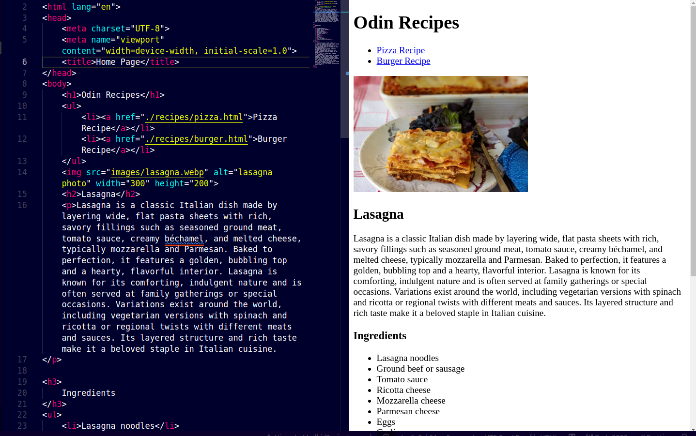

# odin-recipes

This is my first web development project — a simple HTML page that displays recipes for popular foods like lasagna, burgers, and pizza. It’s built using basic HTML and is a beginner-level project to practice structuring web content.

## Features

- Clean and simple layout using only HTML
- Recipes for:
  - Lasagna
  - Burger
  - Pizza
- Organized using headings, paragraphs, and lists

## Screenshots

